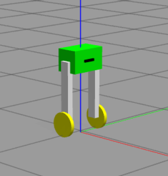

# ROS 2 LQR Balance Car



这是一个基于 **ROS 2 Humble + Gazebo Classic + ros2_control + LQR** 的两轮平衡车学习项目。  
项目现在包含三条主线能力：

- 平衡车建模与 Gazebo 仿真
- 基于 `ros2_control` 的 LQR 底层平衡控制
- 基于 `slam_toolbox + Nav2` 的建图、目标点导航和避障

## Environment

- Ubuntu 22.04
- ROS 2 Humble
- Gazebo Classic

如果系统不是 Ubuntu 22.04，请不要直接安装 ROS 2 Humble。

## Workspace Layout

`src/lqr_controller`
: 自定义 `ros2_control` LQR 控制器，负责把速度命令转换成左右轮 `effort`

`src/robot_description_pkg`
: 机器人 URDF/Xacro、Gazebo 传感器插件、控制器配置与启动文件

`src/robot_state_pub_interface`
: 控制器调试消息接口

`src/balance_nav`
: 里程计节点、`cmd_vel` 安全仲裁、Nav2/SLAM 启动与参数配置

`src/k_calc_python.py`
: 使用 Python 计算 LQR 增益矩阵

`src/K_calc_matlab.m`
: 使用 MATLAB 计算 LQR 增益矩阵

## System Requirements

推荐先安装 `rosdep`：

```bash
sudo apt update
sudo apt install -y python3-rosdep python3-colcon-common-extensions python3-vcstool git
sudo rosdep init
rosdep update
```

### APT Dependencies

如果你想手动安装主要 ROS 依赖，可以执行：

```bash
sudo apt update
sudo apt install -y \
  ros-humble-gazebo-ros-pkgs \
  ros-humble-xacro \
  ros-humble-gazebo-ros2-control \
  ros-humble-ros2-control \
  ros-humble-ros2-controllers \
  ros-humble-navigation2 \
  ros-humble-nav2-bringup \
  ros-humble-slam-toolbox \
  ros-humble-joint-state-publisher
```

### rosdep Install

这个项目已经补齐了 `package.xml` 里的运行依赖，可以直接在工作区根目录执行：

```bash
rosdep install --from-paths src --ignore-src -r -y --rosdistro humble
```

## Python Requirements

根目录的 `requirements.txt` 主要用于 **离线 LQR 增益计算脚本**，不是整个 ROS 工作区运行时的全部依赖。

安装方式：

```bash
pip install -r requirements.txt
```

它会安装：

- `numpy`
- `sympy`
- `control`

## Build

在工作区根目录执行：

```bash
colcon build
source install/setup.bash
```

如果之前的构建缓存损坏，可以清理后重新编译：

```bash
rm -rf build install log
colcon build
source install/setup.bash
```

## Run: Balance Control Only

启动 Gazebo、机器人模型和 LQR 控制器：

```bash
source install/setup.bash
ros2 launch robot_description_pkg robot_display.launch.py
```

另开一个终端进行手动遥控：

```bash
source install/setup.bash
ros2 run teleop_twist_keyboard teleop_twist_keyboard
```

## Run: SLAM + Nav2 Navigation

启动完整导航链路：

```bash
source install/setup.bash
ros2 launch balance_nav balance_nav.launch.py
```

默认行为：

- 启动 Gazebo 和平衡车模型
- 启动 LQR 控制器
- 启动里程计节点
- 启动 `cmd_vel` 安全仲裁节点
- 启动 `slam_toolbox`
- 启动 Nav2
- 启动 RViz

### Navigation Command Flow

现在项目里的控制链路是：

`Nav2 / Teleop -> cmd_vel_gate -> /cmd_vel_safe -> LQR -> wheel effort`

这解决了几个常见冲突：

- Nav2 和手动遥控不会直接同时抢 `/cmd_vel`
- 进入 LQR 前会进行速度限幅和加速度限幅
- 当车身 pitch 过大时，运动命令会被自动清零

### RViz Usage

1. 启动后先让车用手动方式缓慢移动，构建一小块地图
2. 停止手动遥控
3. 在 RViz 里选择 `2D Goal Pose`
4. 点击目标点并给出朝向
5. Nav2 会开始规划并自动导航

## Topics and Responsibilities

`/cmd_vel`
: 手动遥控输入

`/cmd_vel_nav`
: Nav2 输出的速度命令

`/cmd_vel_safe`
: 经过仲裁与限幅后的安全速度命令，LQR 订阅它

`/imu`
: Gazebo IMU 插件输出

`/joint_states`
: 轮子状态

`/scan`
: 前向激光雷达数据

`/odom`
: 里程计节点发布

`/map`
: `slam_toolbox` 生成地图

## Current Limitations

- 该项目更适合学习和仿真验证，不是生产级平衡车控制器
- 里程计是简化实现，精度有限
- Nav2 参数已经按平衡车做了保守化处理，但仍需要根据仿真表现继续调参
- 当前主要依赖激光进行导航避障，深度相机还没有接入 Nav2 的障碍层

## Notes

- `Nav2` 不会直接使用 LQR 算法
- `Nav2` 只负责上层路径跟踪与局部速度命令
- `LQR` 负责底层平衡与轮子 `effort` 控制

如果你要重新计算控制增益，可以运行：

```bash
python src/k_calc_python.py
```

或者使用 MATLAB 版本：

```matlab
K_calc
```
